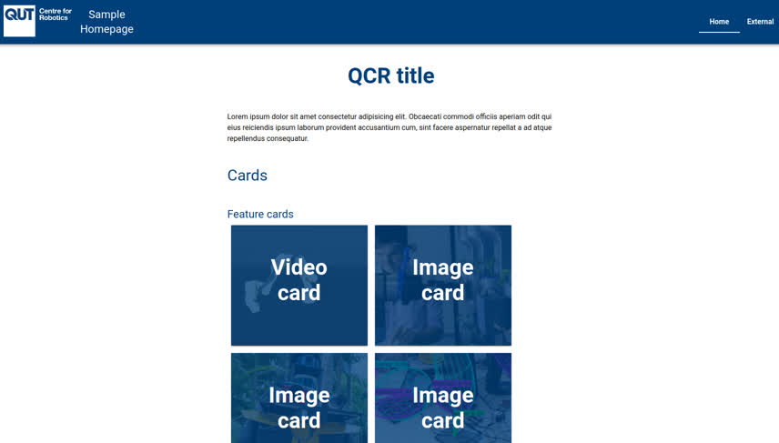

# QCR's shared site development tools



This repository contains tools used in building QCR-branded websites.

It includes:

- styled QCR React components for building pages
- a custom QCR [Material UI theme](https://mui.com/customization/theming/)
- some sensible default global CSS styles
- complete demo page for exploring how to use the components

## Playing with the components in a live demo

Make sure you have the latest LTS of NodeJs installed (see [guide below](#installing-nodejs-on-ubuntu)).

1. Clone this repository, and enter the new `sites-shared` directory:
   ```
   git clone https://github.com/qcr/sites-shared; cd sites-shared
   ```
2. Install node dependencies locally:
   ```
   node install
   ```
3. Start the local development server:
   ```
   npm run dev
   ```
4. Navigate to [localhost:3000](http://localhost:3000) in your browser

## Instructions for building your own site

1. Start a new [NextJs app](https://nextjs.org/docs/getting-started), enabling TypeScript:
   ```
   npx create-next-app@latest --typescript
   ```
2. Add this package as a dependency for your new project:
   ```
   npm install git+ssh://git@github.com:qcr/sites-shared.git#master
   ```
3. Add the QCR theme, CSS, and favicon to your `pages/_app.tsx` (see example in [./pages/\_app.tsx](./pages/_app.tsx))
4. Start building your site by adding QCR components to `pages/index.tsx` (see example in [./pages/\_app.tsx](./pages/index.tsx))

## Installing NodeJs on Ubuntu

1. Install directly from apt:
   ```
   sudo apt install nodejs npm
   ```
2. Globally install the node version management tool:
   ```
   sudo npm install -g n
   ```
3. Update to the latest LTS:
   ```
   sudo n lts
   ```
